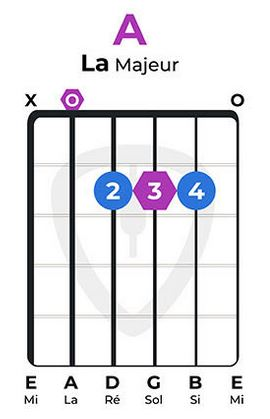
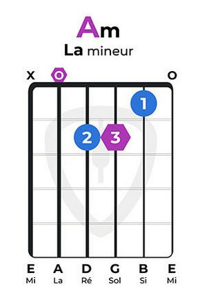
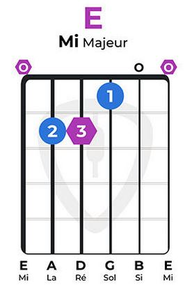
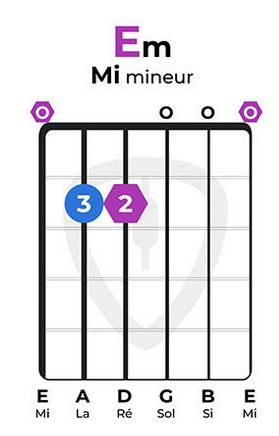
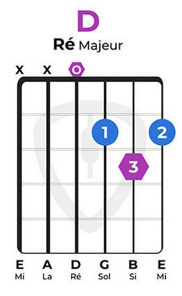
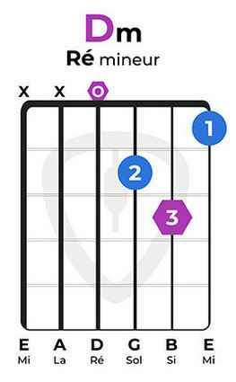
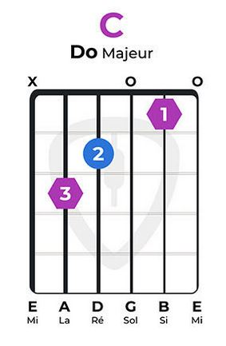
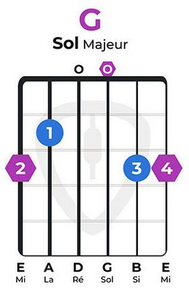

# 🎼 Accords de base

Ordre des cordes, de la plus grave à la plus aigüe :&#x20;

* E : Mi
* A : La
* D : Ré
* G : Sol
* B : Si
* e : Mi aigüe

<figure><figcaption></figcaption></figure>

 

<figure><figcaption></figcaption></figure>

 

<figure><figcaption></figcaption></figure>

 

<figure><figcaption></figcaption></figure>

<figure><figcaption></figcaption></figure>

 

<figure><figcaption></figcaption></figure>

 

<figure><figcaption></figcaption></figure>

 

<figure><figcaption></figcaption></figure>

